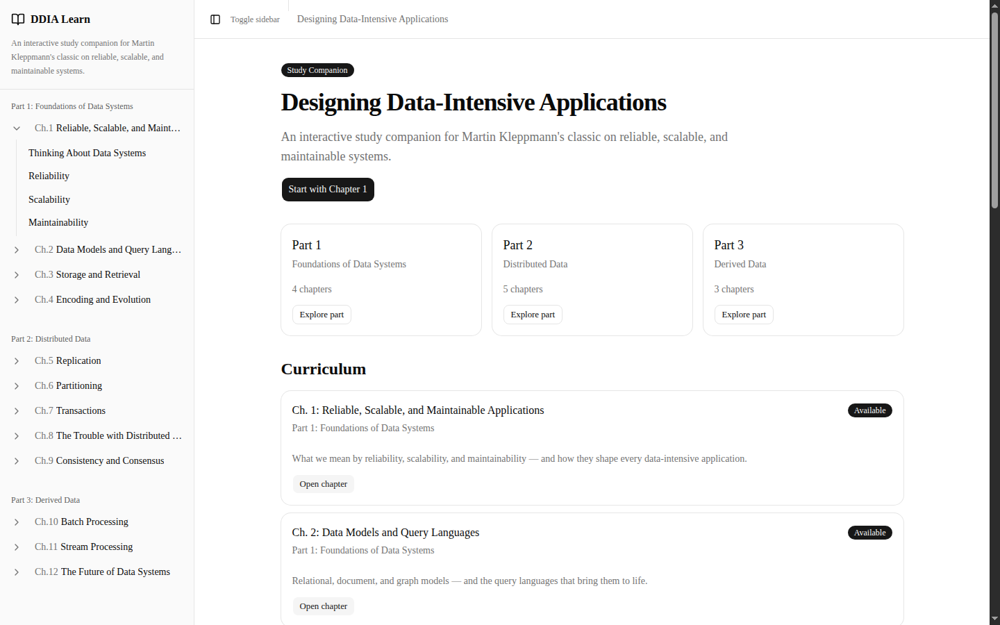
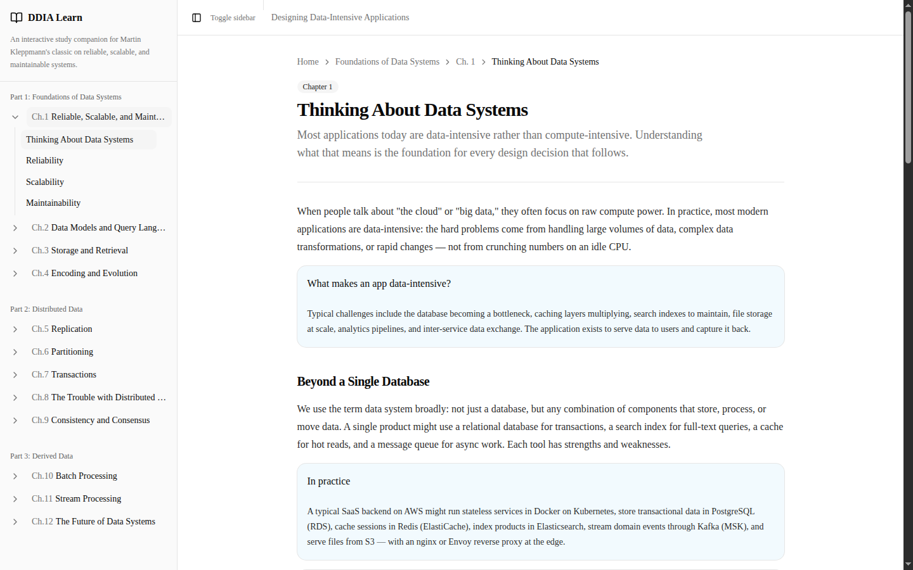
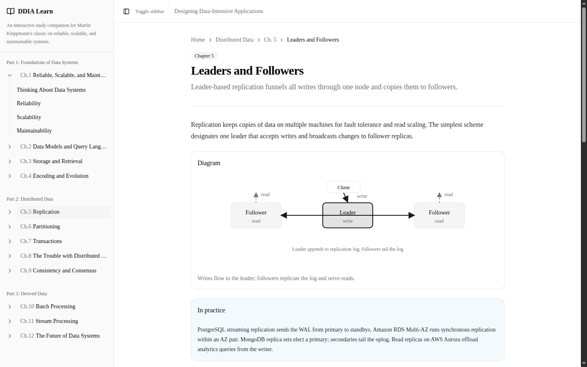
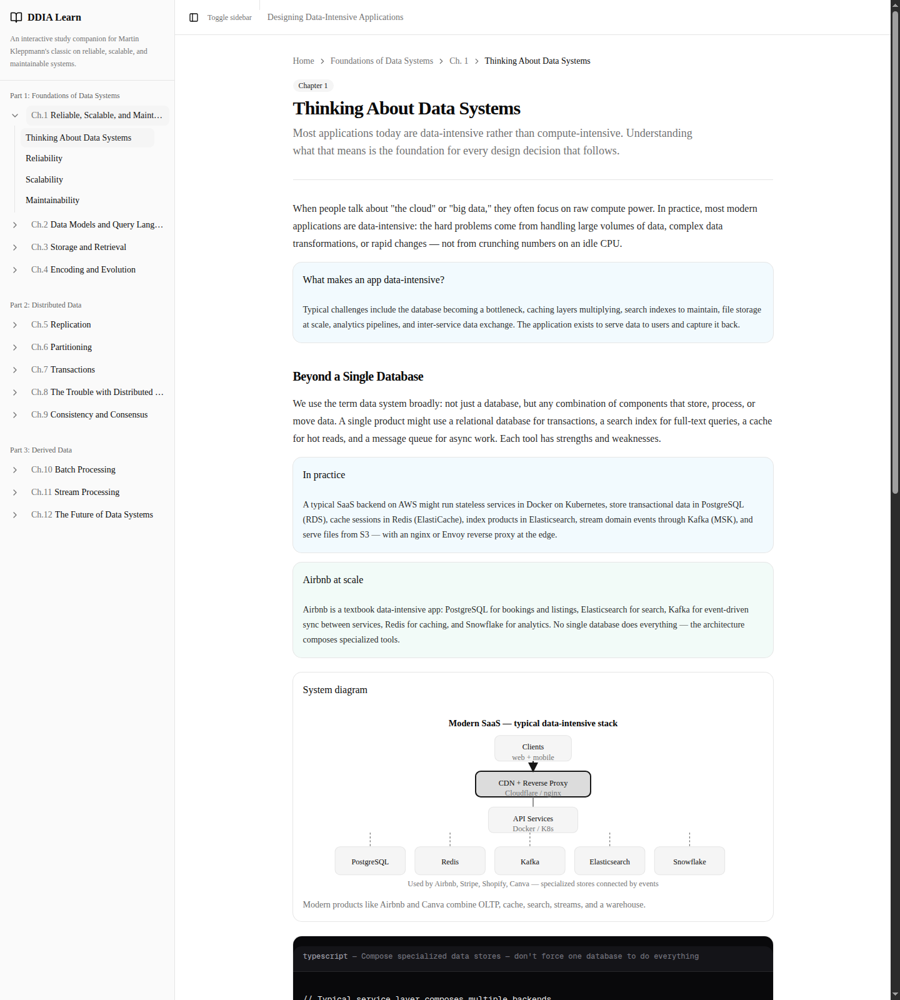
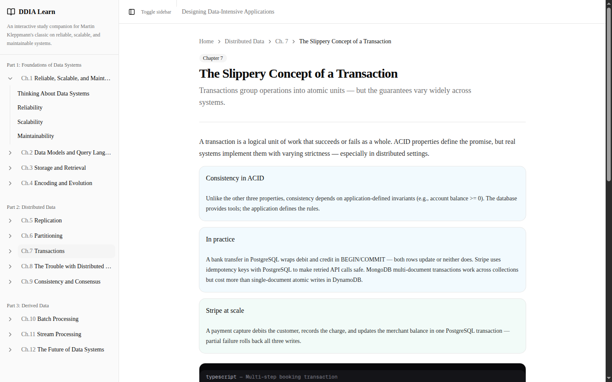

# DDIA Learn

An interactive study companion for [*Designing Data-Intensive Applications*](https://dataintensive.net/) by Martin Kleppmann. Built with **Next.js 16**, **shadcn/ui**, and **Bun** — deployed to **Cloudflare Workers** via OpenNext.

**Live site:** [ddia-learn.exactcover.workers.dev](https://ddia-learn.exactcover.workers.dev/)

## Screenshots

### Home & curriculum

Browse all 12 chapters across 3 parts. Every chapter is available with structured lessons, key takeaways, and navigation.



### Lesson page

Each lesson combines explanatory prose, real-world company examples, and related concepts — with a collapsible sidebar for quick chapter hopping.



### Technical & system diagrams

Concept diagrams (replication, partitioning, quorums) and architecture overviews for products like Airbnb, WhatsApp, and Canva — all rendered as code-built SVGs.





### TypeScript code examples

Lessons include copy-ready TypeScript snippets: Prisma transactions, Kafka consumers, idempotency keys, circuit breakers, and more — tied to how Stripe, Airbnb, and Google build production systems.



## Features

- **40 lessons** across 12 chapters (Foundations, Distributed Data, Derived Data)
- **Technical diagrams** — leader-follower, hash partitioning, quorums, MapReduce, event streams
- **System diagrams** — Airbnb, WhatsApp, Google Search, Meta feed, Canva, modern SaaS stack
- **TypeScript examples** in every lesson with real-world tooling (PostgreSQL, Redis, Kafka, Kubernetes, etc.)
- **Company at scale** callouts — WhatsApp, Facebook, Google, Canva, Airbnb, Stripe, Uber, Netflix
- **Expandable, resizable sidebar** with chapter navigation
- **Cloudflare-ready** — static generation + OpenNext adapter for Workers

## Quick start

```bash
bun install
bun run dev          # Next.js dev server → http://localhost:3000
bun run preview      # Cloudflare workerd preview → http://localhost:8787
bun run deploy       # Deploy to Cloudflare Workers
```

## Content

| Path | Description |
|------|-------------|
| `content/curriculum.json` | Book structure — parts, chapters, sections |
| `content/lessons/index.json` | All 40 lesson bodies (generated + ch01 sources) |
| `content/lessons/ch01-*.json` | Chapter 1 source lessons |
| `scripts/generate-all-lessons.ts` | Regenerate `index.json` from lesson definitions |
| `scripts/lesson-snippets.ts` | Shared TypeScript snippets and content helpers |
| `public/media/` | Grok Imagine concept images (ch01) |
| `src/components/ddia/technical-diagram.tsx` | Code-built SVG technical & system diagrams |

Regenerate lesson content:

```bash
bun run content:build   # Regenerate lessons index from source definitions
bun run content:media   # Update media manifest
```

Add shadcn components:

```bash
bunx shadcn@latest add <component>
```

## Deploy to Cloudflare

Production: [https://ddia-learn.exactcover.workers.dev/](https://ddia-learn.exactcover.workers.dev/)

```bash
export CLOUDFLARE_API_TOKEN=your_token
bun run deploy
```

## Tech stack

- **Runtime / package manager:** Bun
- **Framework:** Next.js 16 (App Router, SSG)
- **UI:** shadcn/ui + Tailwind CSS
- **Deploy:** `@opennextjs/cloudflare` + Wrangler

## Disclaimer

Inspired by [*Designing Data-Intensive Applications*](https://dataintensive.net/) by Martin Kleppmann — use alongside your own copy of the book. Independent study companion; not affiliated with O'Reilly Media or the author.